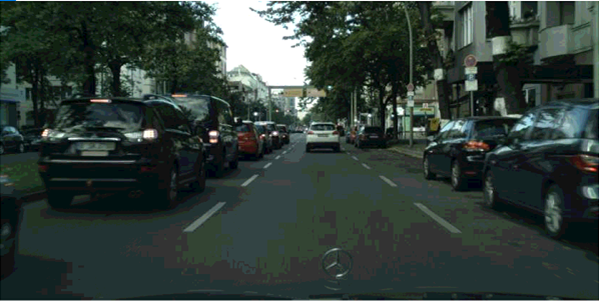
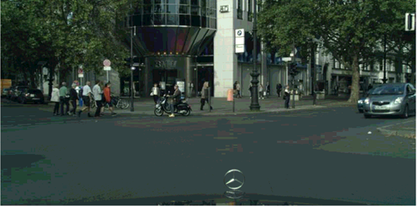

# Panoptic-DeepLab-Mobilenetv2

This is a neat reimplementation of training code for Panoptic-DeepLab with backbone of MobilenetV2, modified from https://github.com/bowenc0221/panoptic-deeplab

Just train from the main.py

Some testing results are shown below

